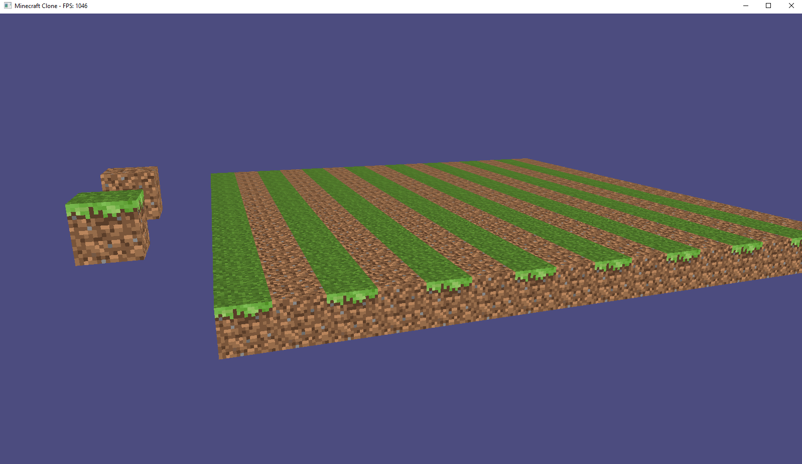
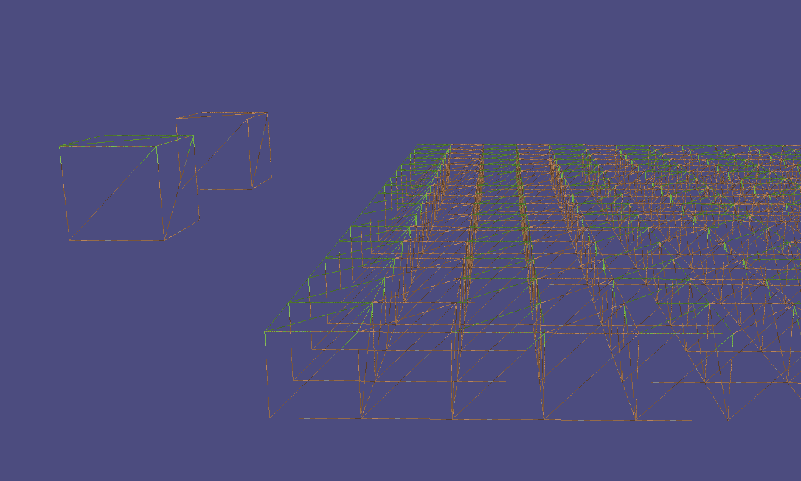

# Minecraft Clone

#### Date: 17.02.2026

## Description

3D game engine based on Minecraft. Written in C++ using OpenGL 3.3 (Graphics), GLFW (Window), GLM (Math) and stb_image (Loading textures).

## Current features

- **Rendering single blocks**
- **AABB Collision detection** - sliding along walls (collision doesn't necessary stop movement).
- **Textures** – textures are loaded by the BlockTextureAtlas class. In the future this will be changed to single atlas texture for all blocks.
- **3D camera** – free movement around the scene.
- **Shaders** - vertex and fragment shaders. Without lighting. 
- **Input system** – handling by InputManager.
- **Game window** – window and OpenGL context management via the Window class.
- **Face culling** - only visible faces of blocks are rendered.
- **Gravity** - ability to jump and fall down. Collision detection from below (landing), above (while jumping) and walking of the cliff.

## Future features
- **Chunk based rendering**
- **Rendering only visible block faces** - touching block faces are not rendered.
- **Lighting**
- **Place and destroy blocks**
- **Rendering only in front of camera** - add second camera to see blocks rendered (bind)
- **Random terrain generation**

## Known issues
1. **Physics** - Moving window while in **physics mode** and **during jump** causes clipping through blocks.

## Directory structure

- `src/core/` – game logic, window, input, world
- `src/graphics/` – rendering, textures, shaders, camera
- `src/world/` – block and chunk definitions
- `src/util/` – empty
- `resources/` – textures

## Requirements

- C++23
- OpenGL
- GLFW
- GLM
- stb_image

## Keybinds
- **TAB** – toggle mouse cursor
- **F1** – toggle wireframe mode
- **F2** – toggle physics

## Images

<i>16.02.2026 – single block rendering with textures</i>

<i>16.02.2026 – wireframe mode</i>

<i>17.02.2026 – gravity</i>
