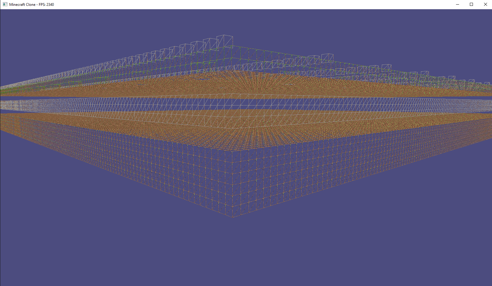
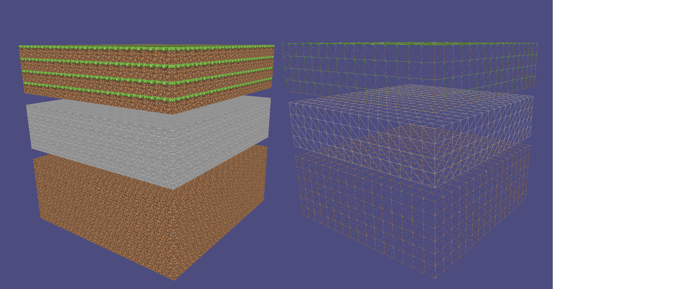
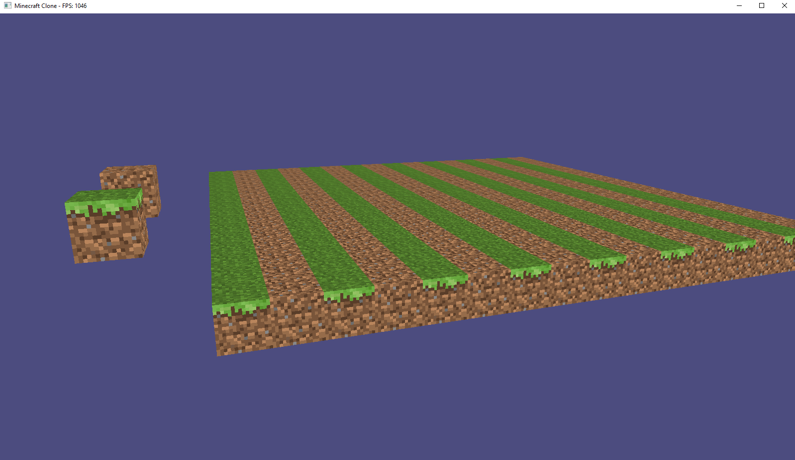
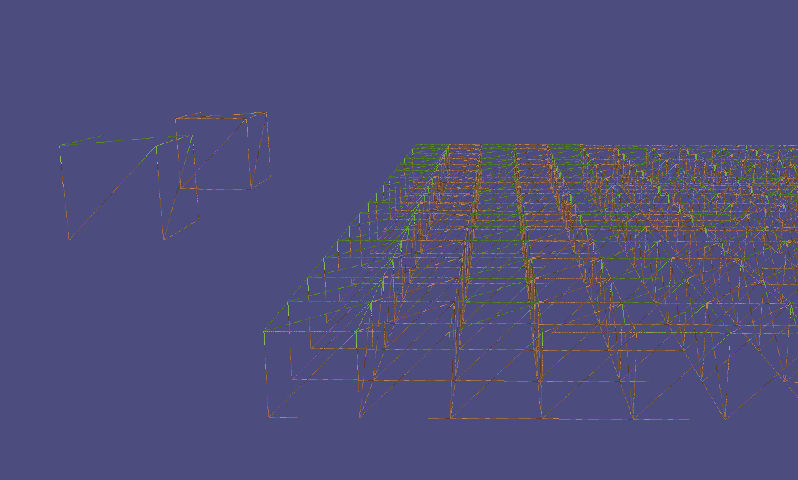

# Minecraft Clone

#### Date: 28.02.2026

## Description

3D game engine based on Minecraft. Written in C++ using OpenGL 3.3 (Graphics), GLFW (Window), GLM (Math) and stb_image (Loading textures).

## Current features

- **Chunk based rendering** - Only visible faces are drawn. 
    - Only visible faces on chunk borders are drawn. Each chunk has function from ChunkManager passed to it to check neighboring chunk isAir().
    - Building mesh has to be initiated by hand ( .buildMesh() ).
- **Destroying blocks**
  - Finding block is based on camera front vector and casting ray.
  - Chunk mesh gets rebuilt after each block destroyed.
  - If destroyed block is on chunk border, neighbor's mesh is also rebuilt.
- **Terrain generation**
  - Spawn player right above the ground.
  - Simple terrain generation based on cos and sin functions.
- **AABB Collision detection** - sliding along walls (collision doesn't necessary stop movement). Collision is detected in 2 block radius from player origin. Chunk is being obtained for each x/z combination.
- **Textures** – textures are loaded by the BlockTextureAtlas class.
- **3D camera** – free movement around the scene.
- **Shaders** - vertex and fragment shaders. Without lighting. 
- **Input system** – handling by InputManager.
- **Game window** – window and OpenGL context management via the Window class.
- **Face culling** - only visible faces of blocks are rendered.
- **Gravity** - ability to jump and fall down. Collision detection from below (while jumping), above (landing) and walking off the cliff.

## Future features
- **Lighting**
- **Place and destroy blocks**
- **Rendering only in front of camera** - add second camera to see blocks rendered (bind)
- **Random terrain generation**
- **Rebuild neighbour chunks meshes after generating new chunks.**

## Known issues
1. **Physics** - Moving window while in **physics mode** and **during jump** causes clipping through blocks.

## Directory structure

- `src/core/` – game logic, window, input, world
- `src/graphics/` – rendering, textures, shaders, camera
- `src/world/` – block and chunk definitions
- `src/util/` – empty
- `resources/` – textures

## Requirements

- C++23
- OpenGL
- GLFW
- GLM
- stb_image

## Keybinds
- **TAB** – toggle mouse cursor
- **F1** – toggle wireframe mode
- **F2** – toggle physics

## Images

<i>27.02.2026 – chunk rendering without chunk borders being rendered</i>

<i>25.02.2026 – chunk rendering with textures</i>

<i>17.02.2026 – gravity</i>

<i>16.02.2026 – single block rendering with textures</i>

<i>16.02.2026 – wireframe mode</i>